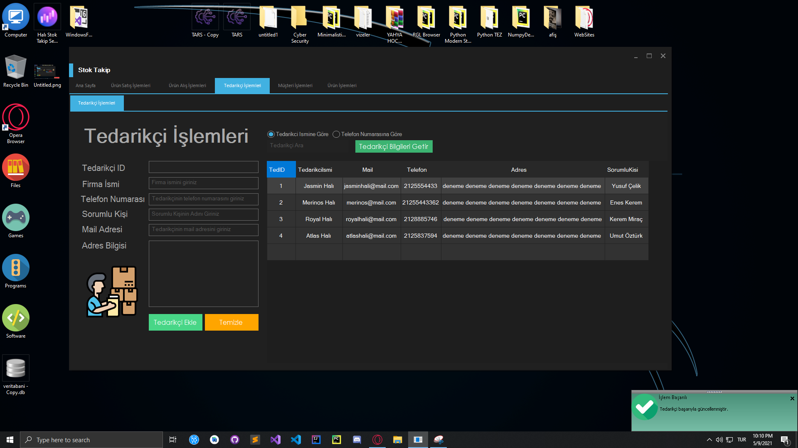

 

  

  <h3 align="center">Stok/Muhasebe Yazılımı</h3>

  

    Stok Takip/Muhasebe Yazılımı  (PROGRAM GELİŞTİRME AŞAMASINDADIR. YAKINDA SETUP YÜKLENECEKTİR)
     
     
    
<address>
      

    <a href="mailto:brktrl@protonmail.ch">Hata Bildir</a>
     
    <!--<a href="http://www.riglsable.rf.gd/" target="_blank">Web Sitesi</a>-->
    

    </address>
    

  

  
<h2 style="display: inline-block">Bilgilendirme</h2>

  <ol>
    <li>
      <a href="#Program-Hakkında">Program Hakkında</a>
      <ul>
        <li><a href="#Ne-İle-Geliştirildi">Ne İle Geliştirildi</a></li>
      </ul>
    </li>
    <li>
      <a href="#Başlangıç">Başlangıç</a>
      <ul>
        <li><a href="#Kurulum">Kurulum</a></li>
      </ul>
    </li>
    <li><a href="#Kullanım">Kullanış</a></li>
    <li><a href="#Desteklediği-İşletim-Sistemleri">Desteklediği İşletim Sistemleri</a>
    <li><a href="#Ornek-Resimler">Örnek Resimler</a>
    <li><a href="#lisans">Lisans</a></li>
    <li><a href="#Iletisim">İletişim</a></li>
  </ol>

## Program-Hakkında

**Tedarikçilerden ürün alış ve satışlara,müşteri ekleme satış oluşturma vb gibi bir çok özelliği ile ücretsiz çoğu kobinin kullanabileceği muhasabe yazılımı**

`BrktrLawliet`,
`brktrl@protonmail.ch`
`Stok/Muhasebe Yazılımı`

### Ne-İle-Geliştirildi

* [C#]()
* [VisualStudio](https://visualstudio.microsoft.com/tr/)

## Başlangıç

Kurulumda Windows işletim sistemleri için sadece setup dosyasını indirmeniz yeterli olacaktır.Açık kaynak kodlu bir yazılım olduğundan dolayı gönül rahatlığı ile programı bilgisayarınıza kurup kullanabilirsiniz.Hiçbir şekilde zararlı yazılım enjekte edilmemiş olup tüm kodları public yani herkese açıktır.(PROGRAM GELİŞTİRME AŞAMASINDADIR. YAKINDA SETUP YÜKLENECEKTİR)

### Kurulum
0. -Windows-

Windows için setup dosyasını indirip klasik bir kurulum dosyası şeklinde kurabilirsiniz. (PROGRAM GELİŞTİRME AŞAMASINDADIR. YAKINDA SETUP YÜKLENECEKTİR)

## Kullanım

Kurma işlemini gerçekleştirdikten sonra soldaki tüm sekmelerin içerisinde yardım menülerini okuyup işlemlerinizi yapınız.Henüz geliştirme aşamasında olduğu için bug'ları bulunabilir.Lütfen bunları bana bildiriniz.

## Desteklediği-İşletim-Sistemleri
* Windows

## Ornek-Resimler
Programın arayüzünden örnek resimler.(Tablolardaki kişisel bilgilerin gerçek bilgiler ile alakası olmayıp,rastgele oluşturulmuş verilerden ibarettir.)
</img> 
</img> 
</img> 
## lisans

Distributed under the APACHE License. See `LICENSE` for more information. 
Copyright (c) 2021 

## Iletisim

E-Mail Adresi:E-Mail - brktrl@protonmail.ch

Proje Linki: [https://github.com/Brktrlw/Stok-Muhasebe-Yazilimi](https://github.com/Brktrlw/Stok-Muhasebe-Yazilimi) 
<!--Web Site Linki: [http://www.riglsable.rf.gd/](http://www.riglsable.rf.gd/)-->

